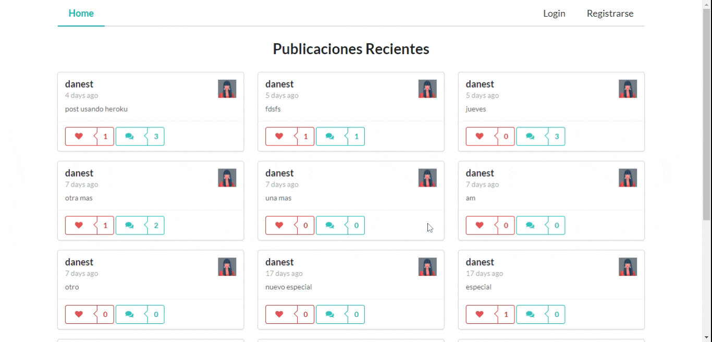

# SOCIAL MEDIA APP

## Descripción
* Aplicación Web tipo red social creada utilizando MERNG STACK (Mongo, Express, React, Node y Graphql)
* Visita la Aplicación Web en: https://social-media-app-merng.dunapanta.vercel.app/
* Backend de la aplicación: https://github.com/dunapanta/Backend-Social-Media-App-MERNG

## Screenshot

## Como ejecutar
* Deploy del Backend
* Clona el repositorio
* Ejecuta `yarn install` 
* Ejecuta `yarn start`